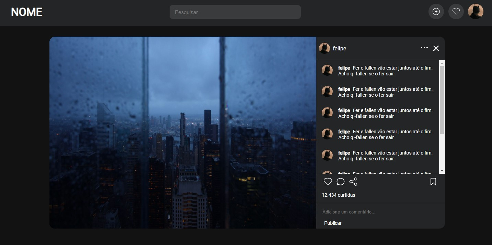

# Front-End-rede-social
Olá, Meu nome é Eduardo este repositório é só o front end. da aplicação ou seja só o HTML e CSS, o beck end. está sendo desenvolvido em PHP neste momento!

# O que é o projeto?
O projeto se trata de um projeto que está sendo desenvolvida por 2 desenvolvedores sem experiência profissional que estão apenas estudando as linguagens ainda. E este projeto é um treinamento nosso. Aonde o projeto é uma rede social mais simplificadas, onde o usuário pode se cadastrar e postar fotos/vídeos/stories no seu perfil e mostra para o mundo, esta repositório é a beta 0.1 do projeto onde só tem o front end do projeto ou seja só a parte de HTML e CSS a parte visual, e o beck end esta sendo desenvolvido neste momento na linguagem PHP.
 
 
 

    <h1>Link do projeto beta 0.1:</h1>
   https://eduardofranco572.github.io/Meu-Portfolio/
    
   
   <h1>Abaixo algumas imagens do projeto</h1>
   
   
   
  
   
   
  
   
   
  O projeto também esta todo responsivo então você pode utilizar pelo celular também
   
   
   
   
   
   
   
   

 

 
  Aqui são umas das linguagens de progamação que estão sendo utilizadas para desenvolver o projeto
 

  
  
  
  
  
            

 

  
 

